# Three-Tier WordPress Solution on AWS

## Project Overview

This project involves deploying a **Three-Tier WordPress application** on AWS using two RHEL 10 EC2 instances. The architecture separates concerns into a **Presentation/Application Tier** (Web Server with Apache, PHP, and WordPress) and a **Data Tier** (dedicated MariaDB database server). Storage on the Web Server is managed with **LVM** across multiple EBS volumes for flexibility and log isolation.

---

## Phase 1: Web-Server Configuration (Presentation & Application Tier)

### 1.1 Infrastructure & Storage Provisioning

The foundation of the Web-Server requires dedicated storage and specific security rules to allow public web traffic.

* **AMI**: Red Hat Enterprise Linux (RHEL) 10.
* **Instance Type**: `t3.micro`.
* **Storage**: 10 GiB (Root, `nvme0n1`) + **2 x 10 GiB EBS Volumes** (`nvme1n1`, `nvme2n1`) attached as `gp3`.
* **Security Group Rules**:
  * **SSH (22)**: Access from `My IP`.
  * **HTTP (80)**: Access from `0.0.0.0/0`.


---

### 1.2 Storage Subsystem (LVM) Setup

We implemented Logical Volume Management (LVM) to manage application data and logs across the two additional 10 GiB disks.

**Discovery — verifying attached disks:**
Before proceeding, `lsblk` was run to confirm which block devices were actually available:

```bash
lsblk
```

Output confirmed two extra disks (`nvme1n1`, `nvme2n1`) were attached. A third volume (`nvme3n1`) was not present, so all LVM work was performed using the two available disks.

> **Expected Output**: `lsblk` confirms only two extra disks are present.
> 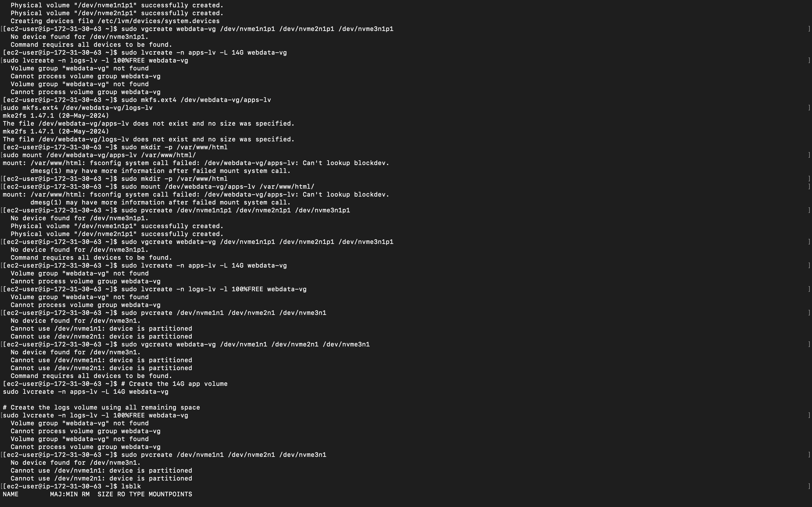

---

**Step 1 — Disk Partitioning:**
Each disk was partitioned interactively with `fdisk`. A GPT label was created (`g`), a new partition spanning the full disk was added (`n`, accepting defaults), and the partition type was set to **Linux LVM** (`t` → `44`).

```bash
sudo fdisk /dev/nvme1n1
# g → n → (defaults) → t → 44 → w

sudo fdisk /dev/nvme2n1
# g → n → (defaults) → t → 44 → w
```

> **Expected Output**: Both disks show a partition of type `Linux LVM`.
> 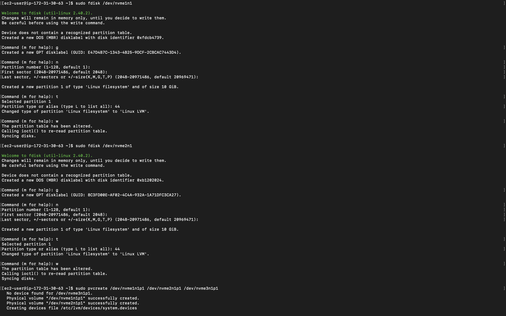

---

**Step 2 — LVM Stack Creation:**

```bash
# Initialize Physical Volumes
sudo pvcreate /dev/nvme1n1p1 /dev/nvme2n1p1

# Create the Volume Group (20 GiB total)
sudo vgcreate webdata-vg /dev/nvme1n1p1 /dev/nvme2n1p1

# Create Logical Volumes
sudo lvcreate -n apps-lv -L 14G webdata-vg       # 14 GiB for the web application
sudo lvcreate -n logs-lv -l 100%FREE webdata-vg   # ~6 GiB for system logs
```

Verified with:
```bash
sudo lvs
```
```
LV      VG         Attr       LSize
apps-lv webdata-vg -wi-a----- 14.00g
logs-lv webdata-vg -wi-a-----  5.99g
```

> **Expected Output**: `sudo lvs` displays both logical volumes with their assigned sizes.
> 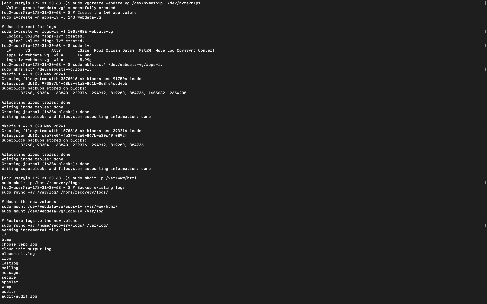

---

**Step 3 — Filesystem & Mounting:**

```bash
# Format both volumes as ext4
sudo mkfs.ext4 /dev/webdata-vg/apps-lv
sudo mkfs.ext4 /dev/webdata-vg/logs-lv

# Create mount points and recovery directory
sudo mkdir -p /var/www/html
sudo mkdir -p /home/recovery/logs

# Preserve existing logs before replacing /var/log
sudo rsync -av /var/log/ /home/recovery/logs/

# Mount the new volumes
sudo mount /dev/webdata-vg/apps-lv /var/www/html/
sudo mount /dev/webdata-vg/logs-lv /var/log

# Restore logs onto the new volume
sudo rsync -av /home/recovery/logs/ /var/log/
```

---

**Step 4 — Persistence via `/etc/fstab`:**

UUIDs were retrieved and written to `/etc/fstab` to ensure mounts survive reboots:

```bash
sudo blkid
```

Key UUIDs captured:
* `apps-lv`: `973897b4-68b2-41a2-851b-0e3fe4ccd4bb`
* `logs-lv`: `c3b73404-fb37-42e0-867b-e30c49f0892f`

```bash
sudo vi /etc/fstab   # Added UUID entries for both LVs

sudo mount -a               # Verify no fstab errors
sudo systemctl daemon-reload
```

> **Expected Output**: `sudo mount -a` completes with no errors; both volumes appear in `df -h`.
> 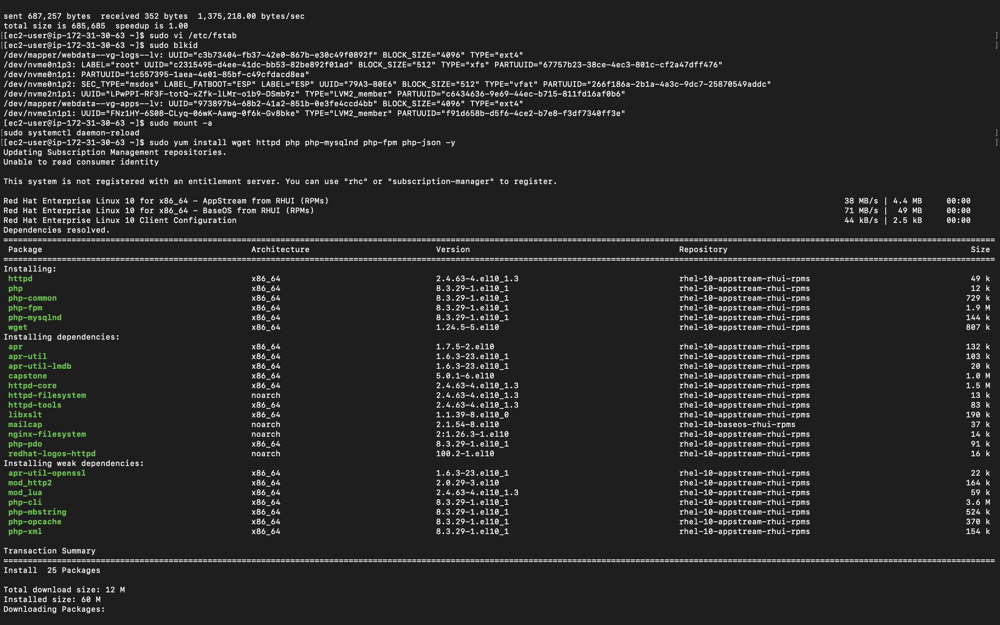

---

### 1.3 Web Stack & WordPress Deployment

With storage ready, we installed the software necessary to serve the application.

**Step 1 — Software Installation:**

```bash
sudo yum install wget httpd php php-mysqlnd php-fpm php-json -y
```

25 packages were installed successfully, including Apache (`httpd 2.4.63`), PHP (`8.3.29`), and all required modules.

> **Expected Output**: `yum` completes with `Complete!` and lists all 25 installed packages.
> 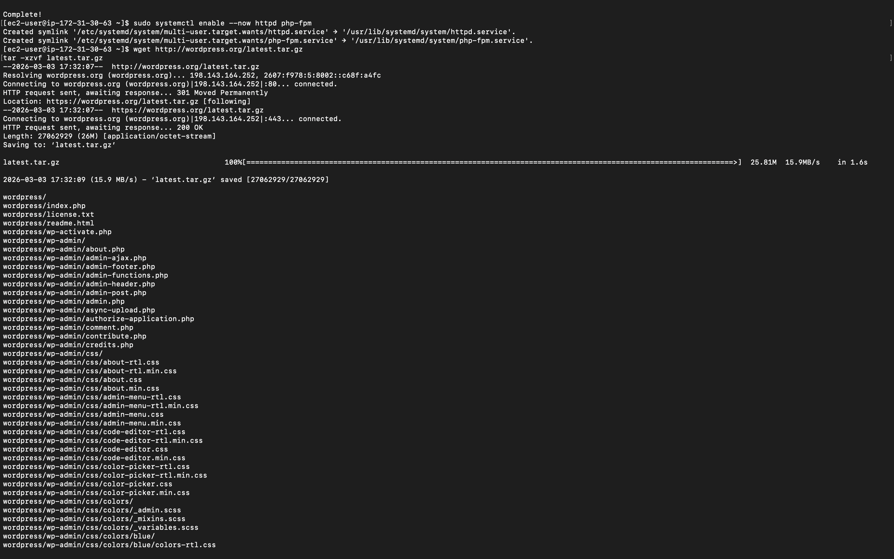

---

**Step 2 — Service Activation:**

```bash
sudo systemctl enable --now httpd php-fpm
```

This enabled and immediately started both Apache and the PHP FastCGI Process Manager, creating the appropriate systemd symlinks.

---

**Step 3 — WordPress Deployment:**

```bash
# Download and extract WordPress
wget http://wordpress.org/latest.tar.gz
tar -xzvf latest.tar.gz

# Copy files into the LVM-backed web root
sudo cp -R wordpress/* /var/www/html/

# Set correct ownership and permissions
sudo chown -R apache:apache /var/www/html/
sudo chmod -R 755 /var/www/html/
```

> **Expected Output**: Files are extracted and copied; `ls -l /var/www/html` shows `apache:apache` ownership.
> 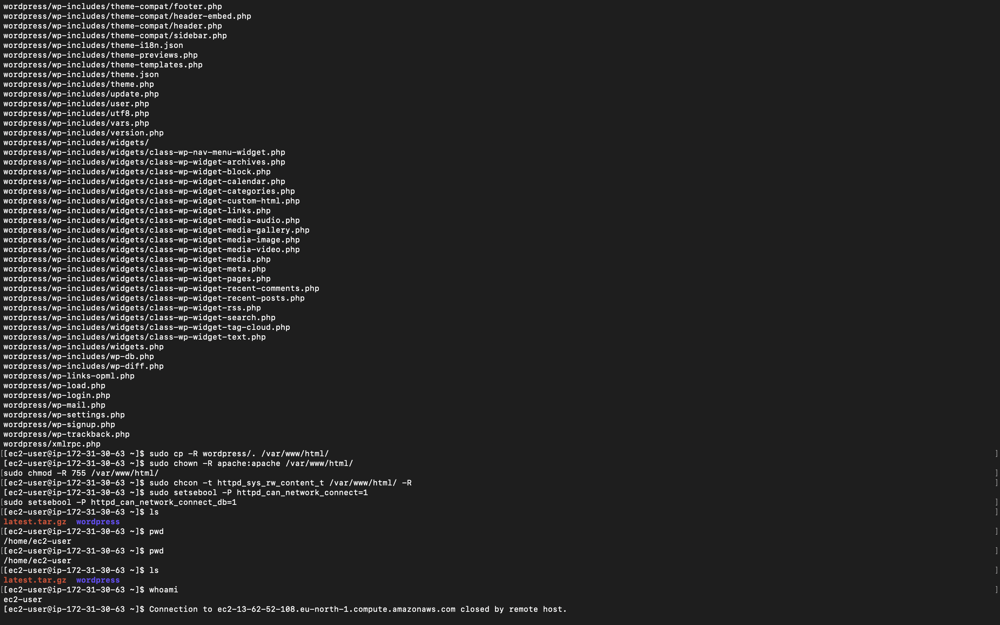

---

### 1.4 RHEL 10 Security Hardening (SELinux)

To allow the Web-Server to function in a production-ready RHEL 10 environment, SELinux policies were adjusted.

**Step 1 — Allow Database Communication:**

```bash
sudo setsebool -P httpd_can_network_connect 1
sudo setsebool -P httpd_can_network_connect_db 1
```

**Step 2 — Label Web Content:**

```bash
sudo chcon -t httpd_sys_rw_content_t /var/www/html/ -R
```

This applied the `httpd_sys_rw_content_t` SELinux context to the WordPress directory, permitting Apache to read and write files as required by WordPress (e.g., plugin installs, uploads).

---

### 1.5 Phase 1 Verification

The final step was verifying that the web server serves the WordPress setup page over the public internet.

> **Expected Output**: The WordPress Language Selection page loads via the Web-Server's public IP.
> 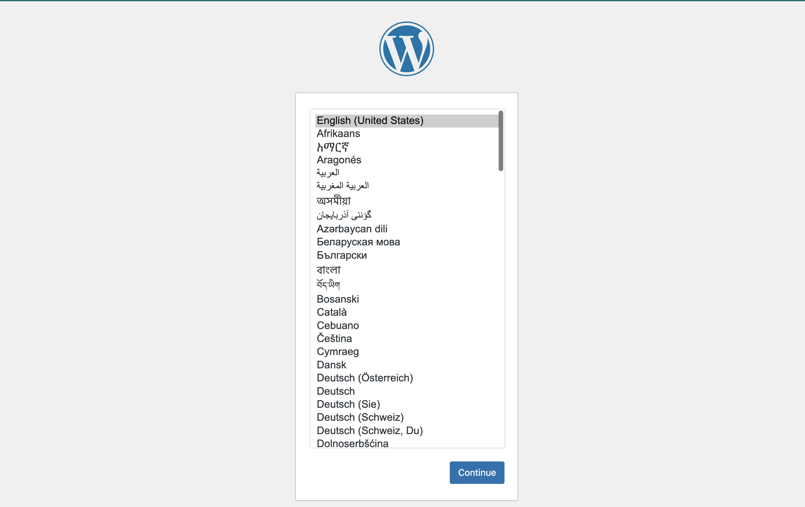

---

## Phase 2: Database-Server Configuration (Data Tier)

### 2.1 Infrastructure

A dedicated EC2 instance was provisioned as the database tier, kept isolated from the public internet (no HTTP inbound rule).

* **AMI**: Red Hat Enterprise Linux (RHEL) 10.
* **Instance Type**: `t3.micro`.
* **Private IP**: `172.31.17.159` (eu-north-1).
* **Security Group**: MySQL/Aurora (3306) open only to the Web-Server's private IP (`172.31.30.63`).

---

### 2.2 MariaDB Installation & Service Setup

```bash
sudo yum install mariadb-server -y
sudo systemctl enable --now mariadb
```

17 packages were installed including MariaDB `10.11.15`, the Perl DBI drivers, and `mysql-selinux`. Three systemd symlinks were created: `mysql.service`, `mysqld.service`, and `mariadb.service`.

> **Expected Output**: `yum` completes with `Complete!`; `systemctl` creates the mariadb symlinks.
> 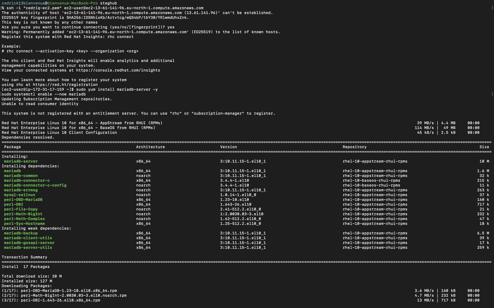

---

### 2.3 WordPress Database & User Provisioning

Accessed the MariaDB shell directly (root, no password set yet on a fresh instance):

```bash
sudo mariadb
```

```sql
-- Create the application database
CREATE DATABASE wordpress;

-- Create a dedicated user restricted to the Web-Server's private IP
CREATE USER 'myuser'@'172.31.30.63' IDENTIFIED BY 'mypassword';

-- Grant full access to the wordpress database only
GRANT ALL PRIVILEGES ON wordpress.* TO 'myuser'@'172.31.30.63';

-- Apply privilege changes immediately
FLUSH PRIVILEGES;

EXIT;
```

The user `myuser` is intentionally bound to `172.31.30.63` (the Web-Server's private IP), ensuring the database is not reachable from any other host.

> **Expected Output**: Each SQL statement returns `Query OK`.
> 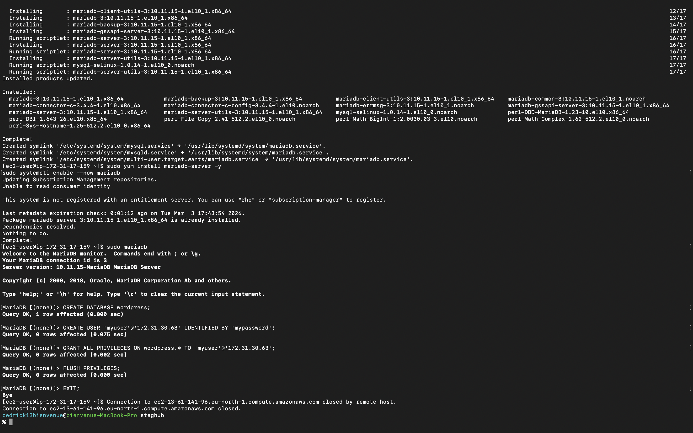

---

## Phase 3: WordPress End-to-End Configuration & Verification

### 3.1 Database Connection Setup

With the DB server ready, the WordPress setup wizard was opened in the browser via the Web-Server's public IP. The database connection details were entered:

| Field | Value |
| --- | --- |
| Database Name | `wordpress` |
| Username | `myuser` |
| Password | `mypassword` |
| Database Host | `172.31.17.159` (DB server private IP) |
| Table Prefix | `wp_` |

> **Expected Output**: The WordPress DB connection form accepts the credentials without errors.
> 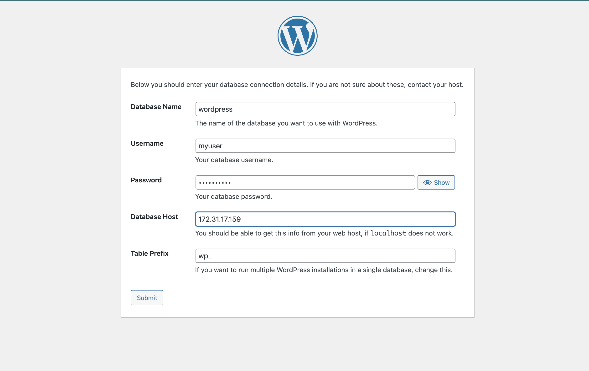

WordPress confirmed the connection was successful.

> **Expected Output**: "All right, sparky! You've made it through this part of the installation."
> 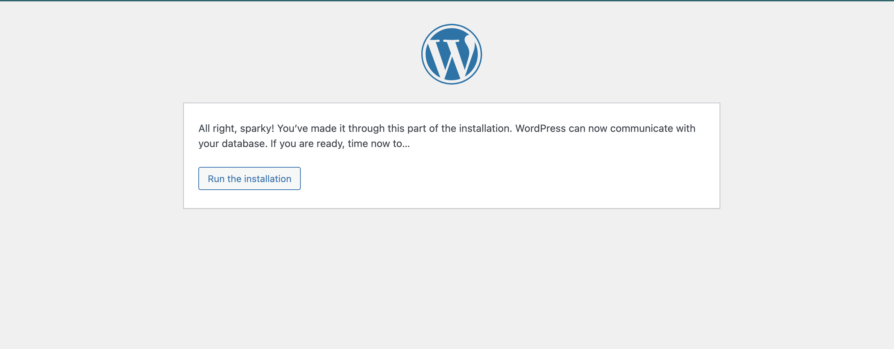

---

### 3.2 WordPress Installation

After confirming the database connection, the installation wizard was completed — site title, admin username (`cedrick13bienvenue`), and password were configured.

> **Expected Output**: WordPress displays the "Success!" confirmation page.
> 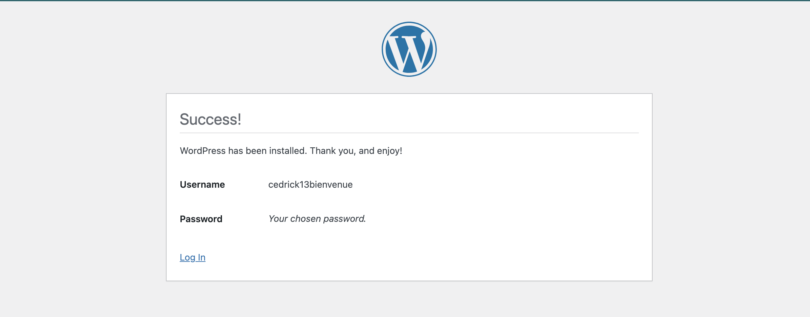

---

### 3.3 Final Verification — Admin Login & Dashboard

Logged in to the WordPress admin panel to confirm end-to-end functionality.

> **Expected Output**: WordPress login page is accessible.
> 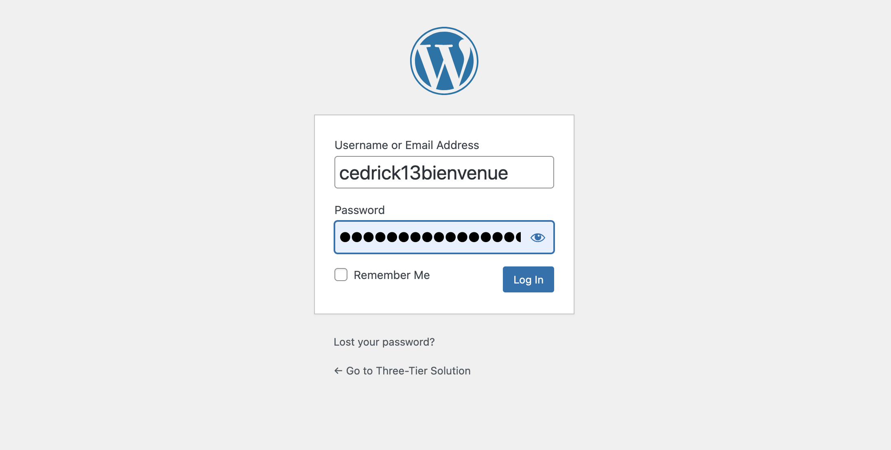

> **Final Verification**: The WordPress admin dashboard loads, confirming the full Three-Tier stack is operational.
> 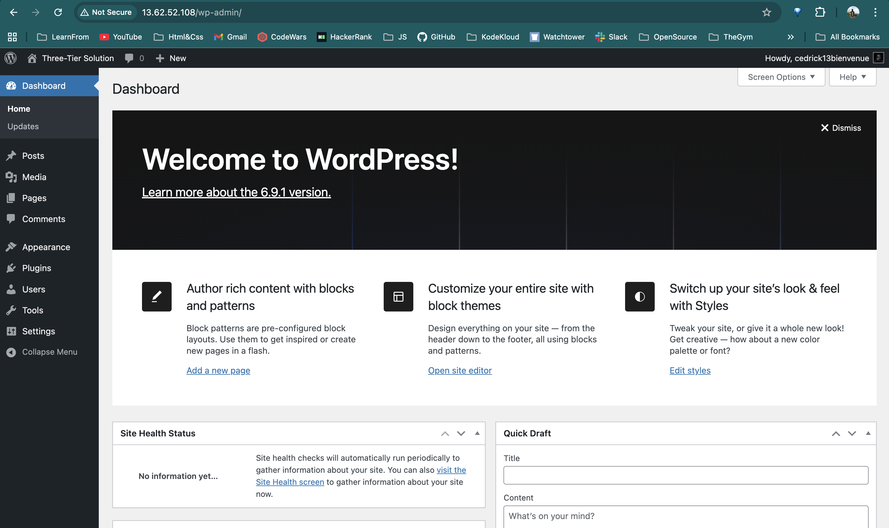

The Three-Tier WordPress solution is fully operational: the Web-Server (Presentation/Application Tier) communicates with the Database-Server (Data Tier) over the private network, serving WordPress to the public internet.

---
